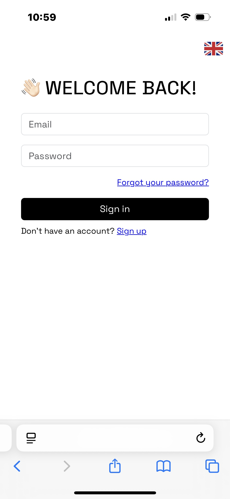
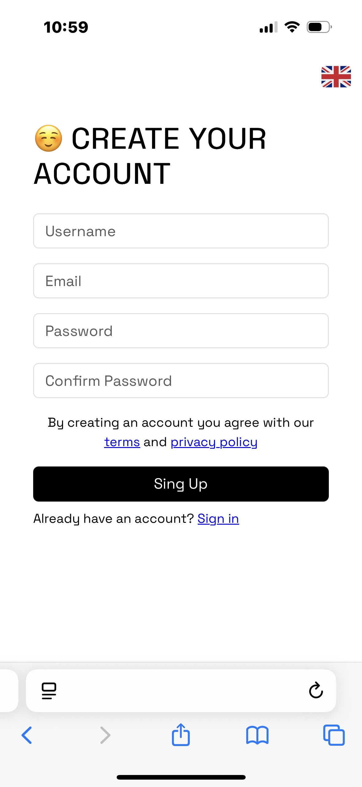
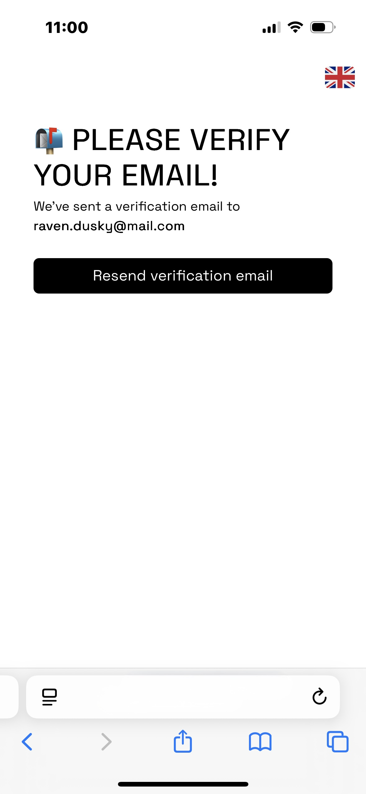
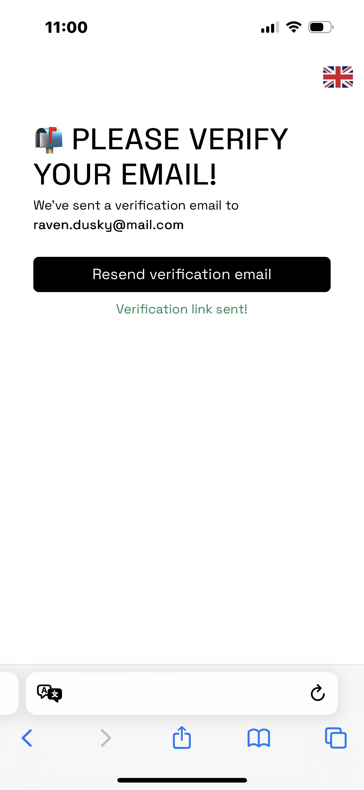
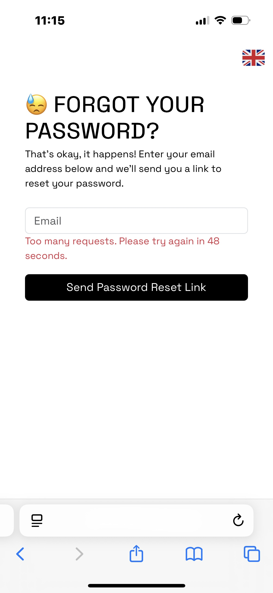
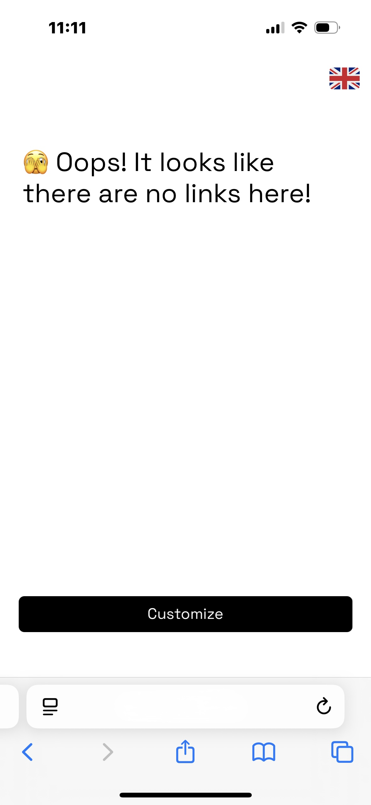
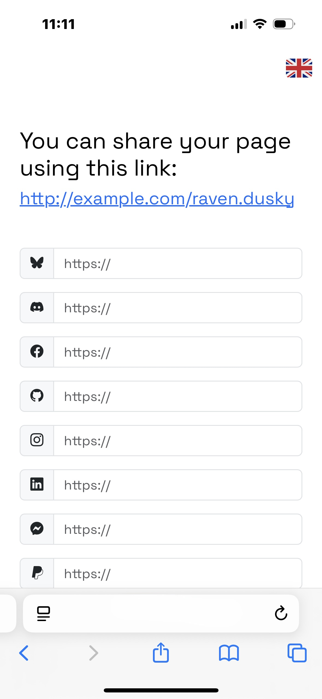
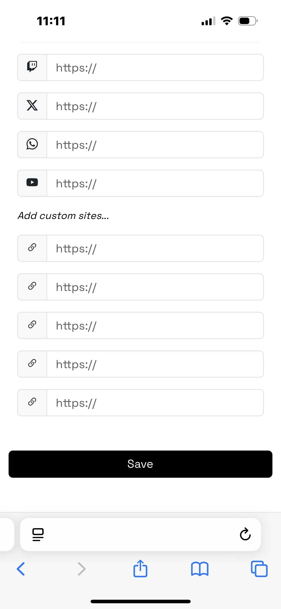
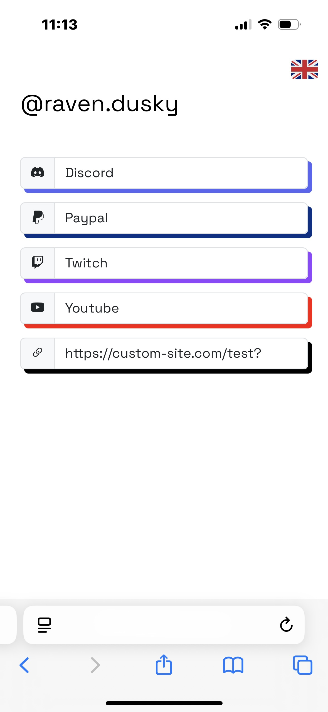

# Linqly.me - Minimalist Linktree Alternative 🌟

Linqly.me is an open-source project inspired by Linktree, designed for those who want to share all their links in a simple, clean, and distraction-free way. The interface is essential: a single page with all your most important links, allowing you to group them into one personalized link.

---

<p align="center">
  
  
  
  
</p>

<p align="center">
  
  
  
  
  
</p>

---

## 🚀 Main Features

- **Secure registration** with mandatory email verification  
- **Password reset** functionality  
- **Customization**: add links to the most popular platforms (about 20, including social, streaming, payments, etc.) + 5 additional generic links  
- **Mobile-first design**, super minimal and intuitive  
- **Secure authentication** powered by Laravel Fortify  

---

## 🛠 Tech Stack

- PHP
- Laravel
- Eloquent
- Fortify
- Livewire
- MySQL
- Bootstrap

---

## ⚡ Installation & Local Setup

Follow these steps to clone and run the project locally:

```bash
# Clone the repository
git clone https://github.com/raven-dusky/linqly.me.git
cd linqly.me

# Install dependencies
composer install
npm install

# Setup environment configuration
cp .env.example .env
php artisan key:generate

# Configure database and mail settings in .env
# (Edit the following lines inside the .env file)
# DB_DATABASE=your_db
# DB_USERNAME=your_user
# DB_PASSWORD=your_password
# MAIL_...

# Run database migrations with seeding
php artisan migrate --seed

# Start local development server
php artisan serve

# In a separate terminal, compile assets with Vite
npm run dev
```
